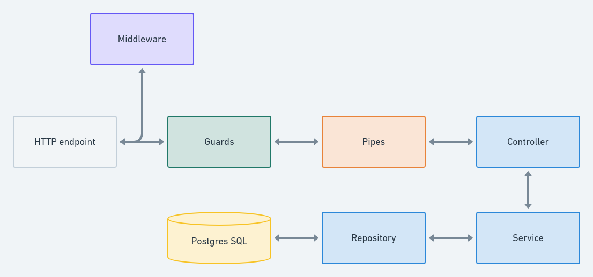
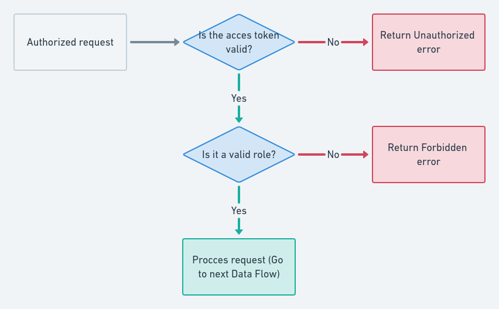

# 🐘 Ecommerce Store Nest y Postgres

Rest Api NestJS + Postgres SQL with authentication with jwt and passport. Validation of actions by roles. With self-generated documentation with Swagger.

## Content

This proyect has one branch: main, contains the final product.
Carrying out the git [trunk based development](https://trunkbaseddevelopment.com/) workflow strategy

## Demo

If you want to see the demo of this proyect deployed, you can visit [Demo of the proyect](https://ecommerce-store-nest-postgres.herokuapp.com/)

## Installation

```sh
# yarn
yarn

# npm
npm install
```

### Running the App

```sh
# development
yarn start

# watch mode
yarn start:dev

# production mode
yarn start:prod
```

### How to start the database container 🐘

```sh
# up in background
docker-compose up -d postgres
```

> Don't forget to fill in the fields of `docker.example.env` and `example.env`

## Data Flow



## Access Token and Role Flow


